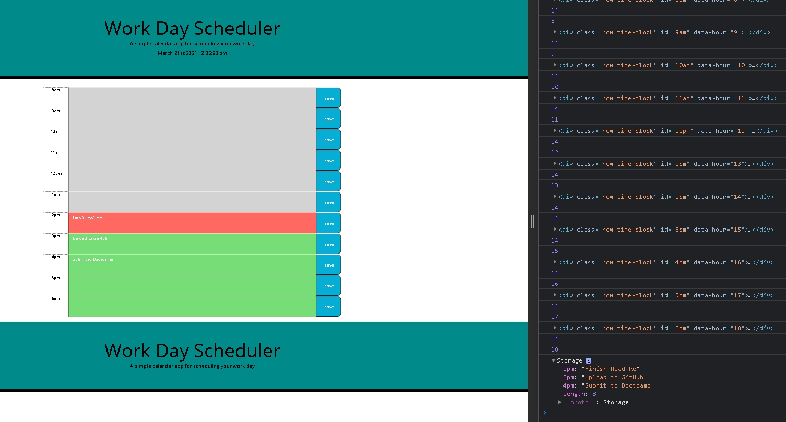

# Work-Day-Planner
Please visit the deployed site  https://domenicsw92.github.io/Coding-Quiz/

# Description 
The purpose of this assignment was to create a Day planner using JQuery and momments.js JavaScript that behaves like so:

When the site is deployed the day planner will react according to the local time. Showing hours past in grey, current time in red and future time in green.

The user of the day planner can save written text in the text form and save it to their local storage to view later and clear when needed 

viewed to to do in local storage 
